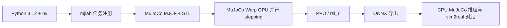

# MicroDuck RL：双足机器人 GPU 仿真

本项目把一个真实的双足机器人强化学习工程接进教程：MicroDuck 约 800 g、约 25 cm 高，使用 14 个 Dynamixel XL330 舵机。策略在 MuJoCo Warp 中并行训练，通过 ONNX 导出后才能进入后续 sim2real 流程。

:::tip[项目状态：已跑通最小闭环]
当前项目已在 NVIDIA RTX 3050 Laptop 4 GiB、Driver 535.309.01（系统报告 CUDA 12.2）上完成依赖安装、任务注册、GPU stepping 和 5 iteration smoke train。兼容分支将 x86_64 Linux 的 Torch 固定为 `2.7.1+cu126`，无需升级宿主机驱动。

AMD GPU 用户请进入独立的 [MicroDuck RL｜AMD ROCm](/docs/practices/amd/microduck-rl) 教程与代码目录。
:::

:::info[本章范围]
本章只要求创建独立环境并完成 64 个并行环境、5 个 iteration 的 GPU smoke test。完整步态训练、W&B checkpoint 管理和真机部署属于后续扩展。
:::

## 你会学到什么

- 为什么双足机器人训练需要 GPU 并行环境，而不是只在单个 MuJoCo 窗口里调参；
- 如何把 MJCF 机器人、BAM 执行器模型、观测、奖励和 PPO runner 注册成 mjlab 任务；
- 如何用 smoke test 提前发现 CUDA、显存、任务注册、观测维度和 NaN 问题；
- 为什么导出 ONNX 时必须保留训练期的观测归一化。

## 项目背景与岗位映射

MicroDuck 是一个小型、低成本的双足平台，适合把“机器人模型 → 并行仿真 → 强化学习 → 部署接口”串成可展示的项目。它的价值不在于用几行代码调用 PPO，而在于把执行器非线性、接触动力学、观测布局、奖励项和部署约束放进同一条可回归的工程链路。

| 项目环节 | 工程能力 | 可迁移到岗位的关键词 |
| --- | --- | --- |
| MJCF / STL 资产 | 机器人结构、碰撞和初始姿态检查 | 机器人建模、仿真资产 |
| BAM 执行器 | 电机力矩、摩擦和饱和近似 | 执行器建模、sim2real |
| mjlab + MuJoCo Warp | GPU 并行 stepping 和任务管理 | Isaac Lab / mjlab / GPU 仿真 |
| PPO + 61D observation | 观测、奖励、domain randomization | locomotion RL、训练稳定性 |
| ONNX 导出 | 固化 normalizer 和推理接口 | 部署、边缘推理、模型交付 |

## 系统链路



## 环境位置

代码位于仓库的 `codes/practices/humanoid/microduck-rl/`，这是一个独立的 `uv` 项目，不要和 CS123 四足课程共用虚拟环境。两者的 MuJoCo、RL 框架和 CUDA 依赖版本不同。

```bash
cd codes/practices/humanoid/microduck-rl
UV_HTTP_TIMEOUT=600 uv sync --locked
```

首次同步会下载 Torch、CUDA runtime、Warp、mjlab 和 MuJoCo 等大型 wheel。安装过程较慢是正常现象；磁盘和网络缓存应提前预留空间。

兼容当前 Driver 535 的分支使用以下组合：

| 组件 | x86_64 Linux 实测值 |
| --- | --- |
| Python | 3.12.13 |
| Torch | 2.7.1+cu126 |
| Torch CUDA runtime | 12.6 |
| Warp | 1.12.0 |
| mjlab / MuJoCo Warp | 1.3.0 / 3.8.1 |
| GPU | NVIDIA RTX 3050 Laptop 4 GiB |

## GPU smoke test

先确认 MicroDuck 任务已注册：

```bash
uv run list-envs | grep MicroDuck
```

然后运行最小训练：

```bash
uv run train Mjlab-Velocity-Flat-MicroDuck \
  --env.scene.num-envs 64 \
  --agent.max_iterations 5
```

如果没有 W&B API key，使用离线模式即可完成本地验证：

```bash
WANDB_MODE=offline uv run train Mjlab-Velocity-Flat-MicroDuck \
  --env.scene.num-envs 64 \
  --agent.max_iterations 5
```

验收时至少记录以下信息：

| 检查项 | 通过标准 |
| --- | --- |
| CUDA 初始化 | Torch / Warp 找到 GPU，无 driver 初始化错误 |
| 环境构建 | 任务注册成功，MJCF 和网格资产加载成功 |
| stepping | 5 个 iteration 正常结束 |
| 数值稳定性 | 无 NaN / Inf，观测维度保持 61D |
| 资源 | 显存没有持续溢出，记录每轮耗时 |

Smoke test 通过只说明“训练管线能跑”，不代表策略已经学会走路。完整训练前需要逐步增加 `num-envs`，并观察显存、吞吐和 episode reward。

### 实测结果

以下结果来自兼容分支 `feat/microduck-rl-cuda122`（commit `6904111`），复测时间为 2026-08-31：

| 检查项 | 实测结果 |
| --- | --- |
| 任务注册 | `list-envs` 找到 `Mjlab-Velocity-Flat-MicroDuck` |
| Torch CUDA | `cuda_available=True`，识别 RTX 3050，CUDA 张量求和 `1024.0` |
| Warp CUDA | 初始化成功，识别 `cuda:0` / `sm_86` |
| GPU stepping | 64 个并行环境，设备 `cuda:0` |
| 训练迭代 | 5/5 完成，累计 7,680 steps，退出码 `0` |
| 每轮耗时 | 4.40s、4.21s、3.85s、4.03s、4.23s |
| 数值检查 | 无 NaN、Inf、OOM 或 CUDA error |
| 产物 | `model_4.pt`（约 4.7 MiB）和 ONNX（约 776 KiB） |

首次启动会看到 `CUDA Graphs disabled: driver 12.2 < 12.4`。这是预期的兼容性降级：MuJoCo Warp 关闭 CUDA Graphs，但普通 GPU stepping 和训练迭代仍可运行。

### Demo：播放 checkpoint 或 ONNX

Smoke checkpoint 可以用于验证“训练产物能被 viewer 加载”。在有桌面显示会话的开发机上执行：

```bash
RUN_DIR="$(find logs/rsl_rl/velocity -mindepth 1 -maxdepth 1 -type d -printf '%T@ %p\n' | sort -nr | head -1 | cut -d' ' -f2-)"
uv run play Mjlab-Velocity-Flat-MicroDuck \
  --checkpoint-file "$RUN_DIR/model_4.pt" \
  --num-envs 1
```

如果只想验证部署侧 ONNX 接口，可以运行：

```bash
RUN_DIR="$(find logs/rsl_rl/velocity -mindepth 1 -maxdepth 1 -type d -printf '%T@ %p\n' | sort -nr | head -1 | cut -d' ' -f2-)"
uv run scripts/infer_policy.py \
  --walking "$RUN_DIR/$(basename "$RUN_DIR").onnx" \
  --new-cmd-obs
```

这两个 demo 的定位是“加载、推理和仿真链路验证”。5 iteration checkpoint 训练步数很少，不能把 viewer 中的动作当作已经收敛的行走策略；要展示稳定步态，需要更长训练并固定 checkpoint 来源。训练产生的 `.pt`、ONNX 和 W&B offline run 默认留在本地，不提交到教程仓库，以避免二进制和实验日志膨胀。

## 多模式独立训练矩阵

MicroDuck 的动作并不是一套权重覆盖所有目标。每个任务族都有自己的奖励、命令或地形配置，因此本轮为每个模式单独创建 PPO run 和 checkpoint；共享的只是 61D actor observation / 14D action 接口以及运行时切换约定。下面是当前 CUDA 12.2 兼容分支在 RTX 3050 Laptop 4 GiB 上的独立 smoke 结果：

| 任务 | 配置 | 结果 |
| --- | --- | --- |
| `Mjlab-Velocity-Flat-MicroDuck` | 32 env × 50 iter | `model_49.pt`，通过 |
| `Mjlab-Velocity-Rough-MicroDuck` | 32 env × 50 iter | `model_49.pt`，通过 |
| `Mjlab-VelStand-Flat-MicroDuck` | 32 env × 50 iter | `model_49.pt`，通过 |
| `Mjlab-VelStand-Rough-MicroDuck` | 32 env × 50 iter | `model_49.pt`，通过 |
| `Mjlab-StandUp-Flat-MicroDuck` | 32 env × 10 iter | `model_9.pt`，通过 |
| `Mjlab-StandUp-Rough-MicroDuck` | 32 env × 50 iter | `model_49.pt`，通过 |
| `Mjlab-SitStand-Flat-MicroDuck` | 32 env × 50 iter | `model_49.pt`，通过 |
| `Mjlab-SitStand-Rough-MicroDuck` | 32 env × 50 iter | `model_49.pt`，通过 |
| `Mjlab-GroundPick-Flat-MicroDuck` | 32 env × 50 iter | `model_49.pt`，通过 |
| `Mjlab-GroundPick-Rough-MicroDuck` | 32 env × 50 iter | `model_49.pt`，通过 |
| `Mjlab-BallKick-Flat-MicroDuck` | 32 env × 50 iter | `model_49.pt`，通过 |
| `Mjlab-Velocity-Flat-MicroDuck-Rollers` | 32 env × 50 iter | `model_49.pt`，通过 |
| `Mjlab-Velocity-Swizzle-MicroDuck` | 32 env × 50 iter | `model_49.pt`，通过 |
| `Mjlab-RollerCrouch-Flat-MicroDuck` | 32 env × 50 iter | `model_49.pt`，通过 |
| `Mjlab-RollerSlope-Flat-MicroDuck` | 32 env × 50 iter | `model_49.pt`，通过 |
| `Mjlab-RollerStandUp-Flat-MicroDuck` | 8 env × 50 iter | `model_49.pt`，通过（修复后） |
| `Mjlab-Spin-Flat-MicroDuck` | 32 env × 50 iter | `model_49.pt`，通过 |
| `Mjlab-Roulade-Flat-MicroDuck` | 32 env × 50 iter | `model_49.pt`，通过 |

批次使用 `WANDB_MODE=offline`、`env/agent seed=42` 和 TensorBoard logger，任务串行执行以控制 4 GiB 显存；所有任务均退出码 `0` 并生成 checkpoint。完整命令可按下面模板替换任务 ID：

```bash
cd codes/practices/humanoid/microduck-rl
WANDB_MODE=offline uv run train Mjlab-Velocity-Flat-MicroDuck \
  --env.scene.num-envs 32 --env.seed 42 --agent.seed 42 \
  --agent.max-iterations 50 --agent.save-interval 50 \
  --agent.logger tensorboard --agent.experiment-name mode_matrix_smoke \
  --agent.upload-model False
```

其中 `RollerStandUp` 首次运行暴露了一个真实的配置 bug：滚轮模型的奖励使用了包含被动轮关节的 articulated 索引，而 pose reward 直接索引 14D servo 张量，触发 CUDA index-out-of-bounds。现已在 `src/mjlab_microduck/tasks/mdp.py` 增加 articulated→servo 映射；修复后 8 env × 50 iter 通过，`standing_composite` 和高度奖励正常出现。该矩阵仍然是“每个任务能独立训练并产出轨迹”的 smoke，不代表 18 个策略都已收敛；要验收稳定动作，需要按任务分别续训到数百至数千 iterations，并为每个 checkpoint 做固定命令的离屏回放。

### 回归测试

项目还提供 CPU 可运行的配置不变量、奖励函数和 NaN 防护测试：

```bash
uv run --with pytest pytest tests/ -q
```

兼容分支最近一次结果为 `154 passed, 1 skipped`；跳过项是仅针对 linux-aarch64 + GPU 的实机检查。单元测试不替代 GPU smoke train，二者分别覆盖“逻辑回归”和“运行时闭环”。

## 较长训练与可视化展示

Smoke test 之后，可以用固定 seed 做一个 500 iteration 的较长训练，观察奖励、存活时间和命令跟踪误差的趋势：

```bash
uv run train Mjlab-Velocity-Flat-MicroDuck \
  --env.scene.num-envs 64 \
  --env.seed 42 \
  --agent.seed 42 \
  --agent.max-iterations 500 \
  --agent.save-interval 100 \
  --agent.logger tensorboard \
  --agent.experiment-name velocity_long \
  --agent.run-name cuda122-500 \
  --agent.upload-model False
```

训练完成后，用仓库内的 `scripts/plot_training.py` 从 TensorBoard event 文件生成报告：

```bash
RUN_DIR="$(find logs/rsl_rl/velocity_long -mindepth 1 -maxdepth 1 -type d -printf '%T@ %p\n' | sort -nr | head -1 | cut -d' ' -f2-)"
uv run python scripts/plot_training.py \
  --run-dir "$RUN_DIR" \
  --out "$RUN_DIR/microduck-training-500.webp"
```

### 本次实测曲线

| 指标 | 结果 |
| --- | --- |
| 训练规模 | 64 envs × 500 iterations，累计 768,000 transitions |
| mean reward | `0.1711` → `2.5424`，最高 `2.7410` |
| mean episode length | 约 `34` → `57.69` steps |
| action std | `1.00` → `0.73` |
| 训练状态 | 退出码 `0`，无 NaN、Inf、OOM 或 CUDA error |


下面的近景 GIF 来自最终 `model_499.pt` 的 200 帧离屏回放；同一段内容也提供 [MP4 下载](./figs/microduck-training-500.mp4)。


视频和曲线的定位是“训练趋势、checkpoint 加载和仿真渲染链路展示”。当前只训练了 500 iteration，画面中的动作不应被解释为已经收敛的稳定步态；完整训练仍需更长 horizon、多个 seed、速度跟踪指标和 sim2real 评估。

## 深度训练：把“能跑”推进到稳定步态

500 iteration 的结果适合展示训练闭环，但回放中仍会侧倒或坐倒。要验收稳定步态，不能只看 reward 曲线，还要同时看存活时长、跌倒终止和固定 checkpoint 的离屏视频。当前兼容分支在 4 GiB RTX 3050 上采用 256 个并行环境，基于已完成的 500 iteration checkpoint 续训：

```bash
uv run train Mjlab-Velocity-Flat-MicroDuck \
  --env.scene.num-envs 256 \
  --env.seed 42 \
  --agent.seed 42 \
  --agent.resume True \
  --agent.load-run '2026-09-01_16-26-47_env256-bench' \
  --agent.load-checkpoint 'model_518.pt' \
  --agent.max-iterations 3000 \
  --agent.save-interval 250 \
  --agent.logger tensorboard \
  --agent.experiment-name velocity_long \
  --agent.run-name env256-long \
  --agent.upload-model False
```

训练日志和 checkpoint 保留在本地 `logs/rsl_rl/velocity_long/`，不提交到 Git。可随时用同一个绘图脚本查看中间结果：

```bash
uv run python scripts/plot_training.py \
  --run-dir logs/rsl_rl/velocity_long/<run-name> \
  --out logs/rsl_rl/velocity_long/<run-name>/progress.webp
```

建议把 checkpoint 标为“稳定”前满足以下条件：

| 验收项 | 建议标准 |
| --- | --- |
| 平均 episode length | 相比 500 iteration 的约 58 steps 持续明显上升，并在后段保持平台 |
| `fell_over` | 后段持续下降，而不是只出现单个低谷 |
| 速度跟踪 | `error_vel_xy`、`error_vel_yaw` 无发散，曲线波动可解释 |
| 离屏回放 | 至少 200 帧（4 秒）连续保持直立和交替步态 |
| 可复现性 | 至少用另一个固定 seed 或重复回放确认不是偶然片段 |

在当前开发机上 CUDA Graphs 因 Driver 535 / CUDA 12.2 被禁用，这是性能降级，不是训练失败；因此 256 环境的吞吐不能直接和上游 4096 环境的 1–2 小时宣传值比较。若长训仍未达到上述标准，应记录为“训练管线已打通、稳定步态尚未验收”，不要用倒地 GIF 代替结果。

### 无显示会话的离屏回放

开发机没有 `DISPLAY` 时，`play --viewer viser` 仍需要较长的 viewer 初始化时间。仓库提供 `scripts/render_checkpoint.py`，直接读取同一策略导出的 ONNX，在 MuJoCo CPU + EGL 渲染 200 帧并输出 MP4/GIF：

```bash
MUJOCO_GL=egl PYOPENGL_PLATFORM=egl \
uv run python scripts/render_checkpoint.py \
  --onnx logs/rsl_rl/velocity_long/<run-name>/<run-name>.onnx \
  --mp4 logs/rsl_rl/velocity_long/<run-name>/checkpoint.mp4 \
  --gif logs/rsl_rl/velocity_long/<run-name>/checkpoint.gif \
  --frames 200 --lin-vel-x 0.15
```

脚本同时报告 `fallen_fraction`、`min_trunk_z_m`、`min_upright_proxy`，便于把“曲线变好但视频仍倒地”的情况挡在教程发布前。

### 本次深度训练结果：`model_1500.pt`

在兼容分支上从 `model_750.pt` 继续训练到 iteration 1500（256 envs，固定 seed 42，累计 4,608,000 个本轮 transitions）。训练曲线和回放分别如下：

| 指标 | iteration 1500 |
| --- | ---: |
| mean reward | 55.92 |
| mean episode length | 760.23 steps |
| `fell_over`（原始终止计数） | 0.125 |
| `time_out`（原始终止计数） | 1.125 |
| 离屏回放 | 200 帧 / 4 秒 |
| 离屏验收 | `done_count=0`，`fell_like_fraction=0` |
| 姿态下界 | `min_trunk_z=0.1029 m`，`min_upright_proxy=0.9784` |


下面的 GIF 使用同一个 `model_1500.pt`，在实际 mjlab/BAM 环境中固定前向速度命令渲染；接触帧保持直立并出现交替脚步。[下载 MP4](./figs/microduck-training-1500.mp4)。


这里的“稳定”是教程展示级验收：固定单一命令、单个环境、4 秒无 termination。它不是多 seed 鲁棒性、rough terrain 或真机安全结论；checkpoint 和训练日志仍保留在本地，不随教程提交。

## 当前开发机注意事项

当前开发机是 RTX 3050 Laptop 4 GiB，Driver 535.309.01，系统报告 CUDA 12.2。兼容分支已将 x86_64 Torch 调整为 CUDA 12.6 用户态组件；如果在其他机器上出现 `insufficient driver`、Warp 初始化失败或显存不足，应把错误原文记录下来，不要直接修改任务奖励。CUDA Graphs 被禁用属于已知限制，不等同于 GPU smoke 失败。

没有 checkpoint 时不能直接运行训练结果播放；应先完成 smoke test，或在后续记录中补充公开 checkpoint / ONNX 的来源。

## 代码实战与练习

1. 把 `--env.scene.num-envs` 从 64 调到 128，比较每轮耗时和显存变化。
2. 找到 [`microduck_velocity_env_cfg.py`](https://github.com/datawhalechina/dive-into-embodied-ai/blob/master/codes/practices/humanoid/microduck-rl/src/mjlab_microduck/tasks/microduck_velocity_env_cfg.py)，标出观测、奖励、命令和 domain randomization 的入口。
3. 运行 `pytest` 后，任选一个失败断言，说明它保护的是哪一个 sim2real 或部署不变量。
4. 解释为什么训练完成后要通过 `scripts/export.py` 导出 ONNX，而不是手动把 `.pt` checkpoint 转成推理模型。

## 项目交付与面试追问

简历可以这样描述：

> 基于 MuJoCo Warp / mjlab 搭建 MicroDuck 双足机器人 GPU 强化学习环境，完成 MJCF 资产、BAM 执行器、61D 观测、奖励与 domain randomization 注册；在 Driver 535 机器上通过 Torch cu126 兼容分支完成 64 环境 PPO smoke train，并导出 ONNX 推理模型。

面试中建议准备以下追问：

- 为什么 Torch cu130 在 Driver 535 上初始化失败，而 cu126 可以工作？
- CUDA Graphs 被禁用后，哪些能力仍然可验证，哪些性能结论不能直接外推？
- 为什么 actor 是 61D 而 critic 是 76D？哪些信息只能给 critic？
- 为什么 ONNX 必须携带训练期 observation normalizer？
- 5 iteration smoke train 与完整 locomotion 收敛之间还缺哪些实验？

## 上游与许可证

本集成基于 [pollen-robotics/microduck_rl](https://github.com/pollen-robotics/microduck_rl) 的 `develop` 分支 commit `d424a0c`。代码保留 Apache-2.0 许可证；3D 模型文件按上游说明使用 CC BY-SA-NC。完整源项目说明保存在代码目录的 `UPSTREAM_README.md`。
